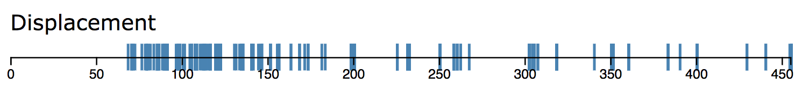
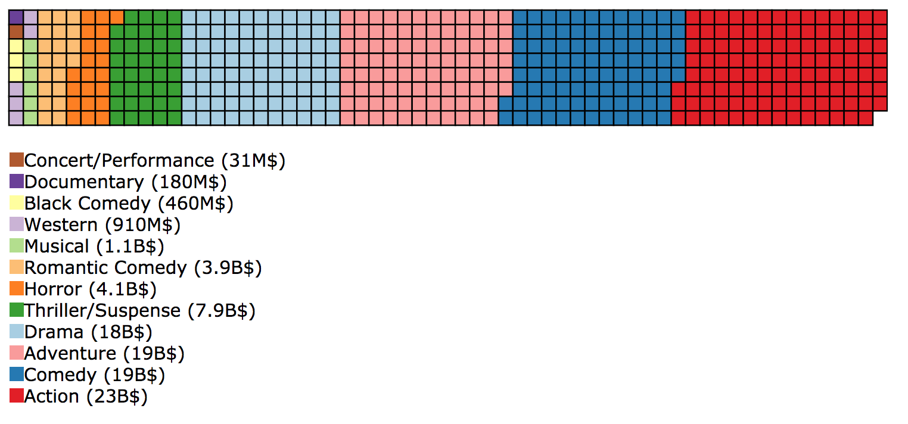
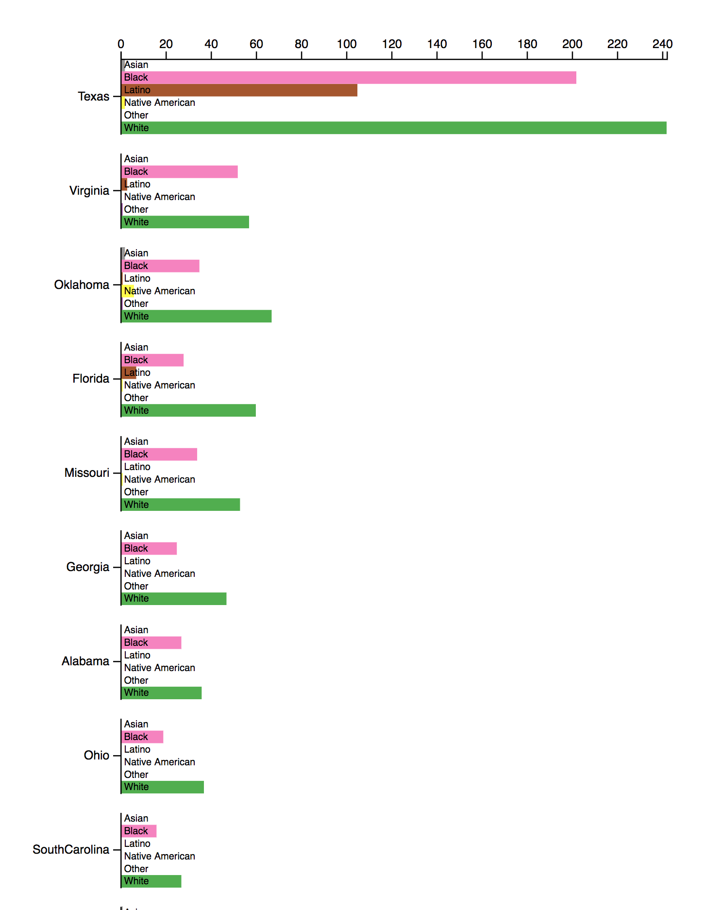
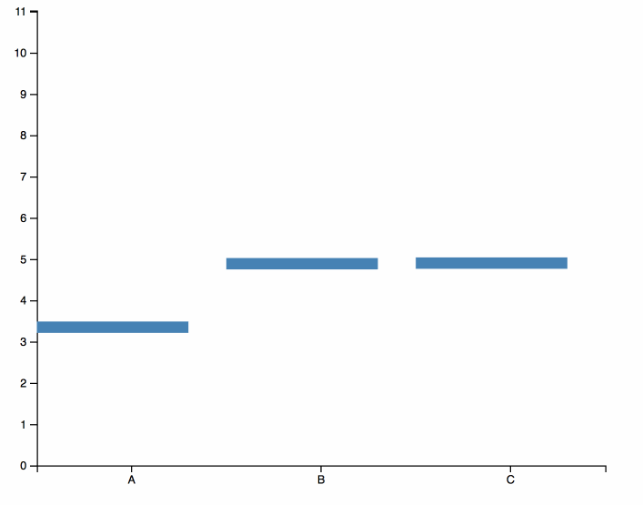
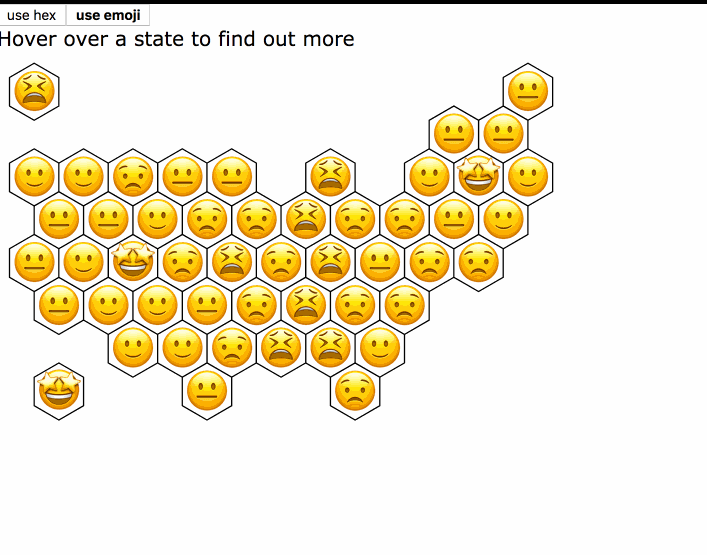
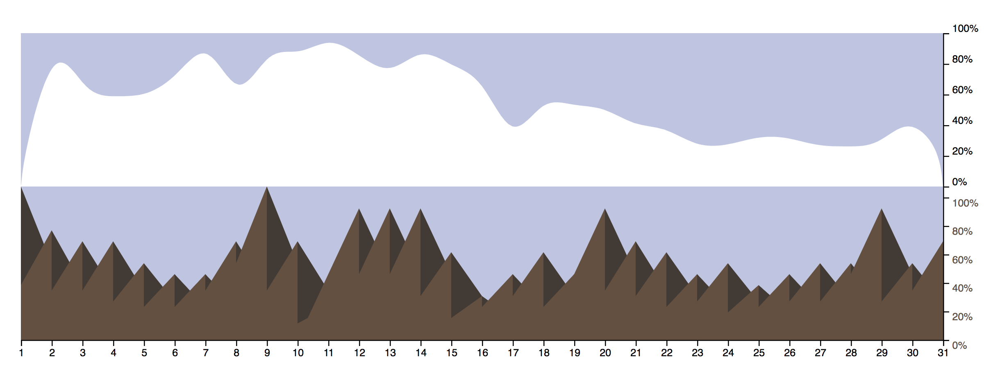

# HW5 - 6 Charts

In this assignment you will implement a sequence of predefined charts. The goal of this assignment will be to help you to develop a vocabulary for creating subsequent charts in d3.js. It will cover a wide range of chart types, ranging from the familiar to exotic. Further it is also designed to help you learn about a number of topics in data visualization that have not yet been covered in the class, such as uncertainty visualization. This sequence is composed in a way that is meant to teach you about all of the different parts of what this library can do, and to push your understanding of charting in general.

Overview:
1. Warm up: Rug Plot
2. Aggregate: Waffle Plot
3. Nesting: Grouped-Stacked Bar Chart
4. Animation: Hypothetical Outcome Plot
5. Interactivity: Chernoff vs Hex Map
6. Finale: Ross-Chernoff Extension

The grade is based on best 3 for graduating students (or those who meet that deadline), or best 4 for everyone else. Each chart will be graded based on the accuracy of the production (see Grading section for more details). This assignment is to be completed alone. If you should find any resources that helped you directly, then you should cite them. You are not allowed to install any additional modules, and you must obey the linting style that we have provided for you. The latter restriction enables us to actually grade style, while the former keeps you honest.  

Throughout the assignment we have listed an approximate number of lines. You should probably think of this as a lower bound, as our code tends to be pretty terse, so if you need some extra space that's just fine. You should take these steps as suggestions, you don't be graded on completing each part. If you can think of a way to implement each chart that differs from the suggestions provided, then go for it.

As the name would suggest this is a somewhat long assignment, so you should make sure to give it due consideration.

# DON'T CHECK IN NODE_MODULES
Seriously! Don't do it! It makes svn worse for everyone.

# Chart 1: Rug Plot
## Warm up

To warm up we'll build a classic univariate chart type. In particular we'll be focused on a visualization that goes by a wide variety of names: rug plot, slash plot, strip plot (https://vega.github.io/vega-lite/examples/tick_dot.html), and many others. If there's a lesson to be gained here it's that chart names are totally arbitrary and subject to group norms and standards. In particular it should look roughly like:

(If you are viewing this as plain text, then just look at the associated image). Your chart should encode the Displacement dimension of the cars dataset as a horizontal rug plot, which should be a simple linear encoding of the data. Make sure the domain of your scale is rooted at zero. Each row in the dataset should be encoded as a vertical bar. There should be an appropriate axis. It should appear to be approximately the associated image. 

**Extension**: If you are feeling ambitious you are welcome to add additional design or functionality to this chart. For instance you might make a dropdown that enables the user to select which dimension is being visualized. This is not necessary and won't affect your grade one way or another.

# Chart 2: Waffle Plot
## Writing Layout Algorithms

Next we will take on one of my favorite charts, the waffle plot. The waffle plot is often referred to as the squarified pie chart. Where pie charts are often derided, waffle plots are strong: they are easy to compare, they rely on a visual channel which is robust to noise, and are based on a potentially more delicious desert. Noted pie chart studier and data vis thought leader/researcher, Robert Kosara, is a fan (https://eagereyes.org/blog/2008/engaging-readers-with-square-pie-waffle-charts). This is not to say they don't have problems; while they work great for displaying the literal number of things, they are often used to represent aggregated data (such as we'll be doing), which is simply a graphical distortion. This can be okay if that distortion doesn't actually distort the message of the chart though!

Let's review how the waffle plot layout algorithm works. The basic idea is, for a variable interest, x, sum all the values of x by group value y. Compute the sum of x. Compute the fraction of each group x to the full sum of x's. Multiply those fractions by the number of boxes you want to use, this is the box count (we use a ceil rounding in order to guarantee each category has at least a box). Create a 1D array of objects, where each object is like [{genre: "horror"}]. For readability make sure to order this array such that the largest number of boxes comes last, the second largest come second to last, etc. Once this is in position, iterate across this array, assigning x and y positions to each box. The modulo operator (which in js is %) will be your friend here, as will Math.floor(). You should now have a dataset that can be easily rendered by a simple d3 command.

In this problem we will construct a waffle plot like the one below. It'll focus on the "movies" dataset which describes ratings, genre, gross, and a number of other factors from a larger array of movies. We will group our cells by major_genre and we will give them weight by production_budget. In particular it'll have approx 60 X 8 waffle cells, which are distributed among the relative values of the sum value.

The boxes in your waffle should be sorted. You should have a legend which declares the color name mapping, and shows the real values for each of the categories. Don't forget to filter the nulls. You can use whatever coloring you want as long as it's legible. Your chart should look approximately like the one shown above.

**Extension**: If you are feeling ambitious you are welcome to add additional design or functionality to this chart. For instance you might add interactivity such that when you hover a chunk of waffle squares, the outline of their union is highlighted by bolding.

# Chart 3: Grouped Bar Chart
## Using Nested Selectors

In this chart you will create a grouped horizontal bar chart. This involves creating a nesting that is multiple levels deep. We've provided several utility functions that will help you execute this process. We'll be looking at a dataset describing people killed in america under the death penalty since 1977. You'll group first state and then by race. The length of your bars will be correlated with the number of people who fall into that bin.  It should look something like:

The bars should be appropriately nested. Each bar has a label (provided by the subaxes) and each state has a label (provided by the primary axis). Each bar is colored according to the race of the people it describes. Do your best not to pick a racist color mapping. Note that this goes way over the end of the page and it is necessary to scroll to see it all. This is one of the more difficult charts in the assignment, so make sure to take your time with it. It can be very rewarding if you can figure it out.

A possible **extension**: In our solution we added text elements to each bar that show the number of people each bar represents. We then set that to always be hidden except when hovering over the bar. This can be achieved through careful organization of the selectors, and some css. Some hints to the css part are the main.css file.

# Chart 4: Hypothetical Outcome Plot
## Using time and animation to express uncertainty
What's the right way to indicate variance in your data? What about expressions of uncertainty? As a human you've no doubt experienced how it's hard to relate probabilities into real world comprehensions of things. A growing line of research in data visualization seeks to answer these questions. Among the prominent practitioners are folks like Jessica Hullman and Matt Kay of the Midwest Uncertainty Collective (https://mucollective.northwestern.edu/). (Hullman is just up the street at Northwestern!) For a splendid introduction to the topic check out here talk at OpenVis17 https://www.youtube.com/watch?v=pTVAn4oLvbc.

In this problem we'll be investigating one of those groups' more creative solutions to uncertainty visualization: HOP plots, or hypothetical outcome plots. They have a number of good medium posts, but i think it's just well covered in that open vis talk. The TLDR is that humans understand things when they build up a mental model of them over time, so rather than present a static visualization like a box plot, show ‘em a bunch of possible outcomes. An effective and non-parameter way to create these alternatives is through bootstrapping, or sample with replacement of datasets.

In particular we'll look at 3 random gaussians with various means and devs. The chart you produce should look like and act like the one above. It should show the means of the groups at each time step. You should bootstrap the data at each time step, and then compute new averages. You should have appropriate axes. 

A possible **extension**: how might interactivity work with these?

# Chart 5: Emoji-Chernoff vs Hex Map
## Interactivity, Color Maps, and Abstract Geographic Maps

Anyone living in modern america knows that there is a problem with maps (https://www.fastcompany.com/90450827/its-official-data-visualization-has-gone-mainstream). In particular there is a frequent mis-step in which land size is misconstrued with the statistic being represented (such as with population with land in the infamous "impeach this" map). There is a long history of different approaches to dealing with this and similar problems through a family of thematic maps called Cartograms (https://en.wikipedia.org/wiki/Cartogram). These maps variously modify the meaning of space to improve legibility or imbue space with additional meaning. 

Way on the other side of the data visualization landscape there's a terrifying graphic called Chernoff-faces. These entities are often used as the boogie-men of bad charts, they are confusing and weird, and don't really convey information in a sensible manner. They draw on the observation that humans have very high quality perception of things that look like human faces, so this type of graphic encodes data into each facial element: the nose the type, the mouth expression, the eyes, etc etc. For instance https://www.axios.com/an-emoji-built-from-data-for-every-state-2408885674.html . 

In this problem we'll be focused on two maps which are debatably cartograms (as they represent space as hexagons in order to be show the underlying statistic of interest, therein distorting the meaning of space) (debatably because a stricter interpretation of cartograms requires them to encode area with a data variable). The first map will be a relatively simple hexagon heatmap. Each hexagon cell will have it's appropriate two letter abbreviation and will be colored based on the value of that state. In a highly-simplified variation of the chernoff-faces the second map will encode this same data as emojis. It will break up the range into quantiles, with each quantile getting mapped to an appropriately chosen emoji (we've provided this range for you, but you can modify it if your changes are comprehensible). Each face will fill up one hexagon. Don't worry about figuring out the layout, we provide that to you as a datafile. Fun fact: this hexagon layout is descended from one created by NPR! 

We'll be focusing on obesity data by state. Your chart should use the hexagon map correctly, it should implement both scales appropriately. Your map  should have a button that allows you to switch between the emoji view and the hexagon view, as well as an in-place tooltip. All together these elements will look like the gif above.

An **extension**: make a legend! This could be for one or both views of the chart.

# Chart 6: Ross-Chernoff Extension
## Area encodings, unusual shapes and a puzzle
The Ross-Chernoff Extension is a visualization that draws inspiration from the Chernoff chart and takes it to its logical conclusion: by mashing it up with the style of Bob Ross. You can find out more about it through it's paper: https://research.tableau.com/sites/default/files/altCHI-preprint.pdf In particular this work is meant to satire why some visualization research doesn't need to be done, but that doesn't stop it from being delightful. I strongly encourage you to go read the paper, it's quick and fun. Although reader beware: it's from a special conference called "alt.chi" which has satirical, funny, experimental, or critical work. There's a wealth of interesting papers at that conference, you should check it out if you have some time for academicish reading.

In particular data is encoded through puffy-cloudy, mighty mountains, and majestic trees. Following Correll's example we will be visualizing the usage of each of those elements in Bob Ross's paintings across his numerous seasons. We will be making use of a dataset collected by 538 that describes the subjects of Ross's paintings over his mighty 31 seasons. In order to simplify our task a little bit, we're going to make Bob sad and remove the majestic trees, so that we will only be rendering the mountains and the clouds. You are making something like the one below.

The first step in building this chart will be to pivot and aggregate the data into a usable format. In particular we want data to be grouped by season, and then counted by item instance, such that the data will have 4 columns: "Season", "Clouds", "Mountains", "Episode Count" and one row for every season. After you've computed these sums, convert them to rates by dividing each by the number of episodes in the corresponding season. As you are building this data object, make sure you are converting the values to numbers (using Number()) or else you will just get long strings. Also don't forget to sort the final data by season!

The mountain shadow is a somewhat unusual feature for a chart. There are lots of ways to build it. Our solution involved building two layers, a background and a foreground. The mountains then consisted of special triangles. In effect it was a lot like building a large number of small shapes using the line function. Note that it was necessary to add white boxes to either side of the plot to hide the overflow from the mountains. Our cloud makes use of curveBundle line smoothing, although you should feel free to use whatever you wish.

Your chart should use an accurate aggregation of the data. It should feature mountains with shadows as shown in the above picture. It should feature a cloud with some sort of line smoothing. It should feature an appropriate background. This one is a bit tricky so make sure to give it plenty of attention. It should appropriately feature all three axes (season, mountains, trees).

An **extension**: Add the trees described in Correll's work. This will involve either finding an appropriate svg asset or creating a custom symbol.

# Grading

As this assignment has correct answers, solutions will be judged both based on correctness and style.

**Correctness** (90%): Each chart is worth equal value. Each chart has a number of assertions associated with them, to score a chart you should simply check if all of the assertions are met. An additional point will be given for idiomatic d3 usage. You are allowed (and encouraged!) to make aesthetic improvements as you wish. These improvements must not modify the essential encodings. 

**Style** (10%): This is an all or nothing check computed by the linter. If you get any warnings or errors you get nothing for this portion of the grade.

